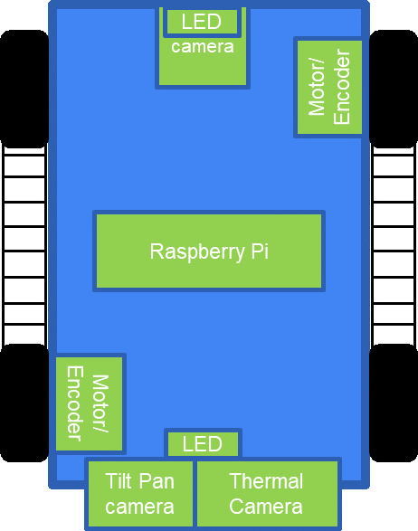
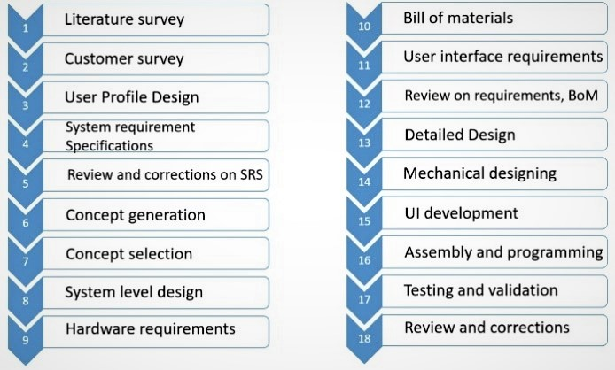
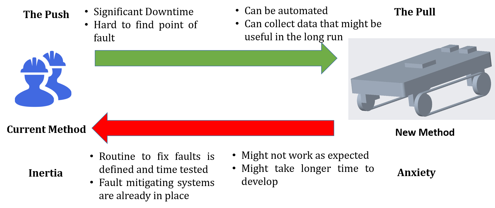
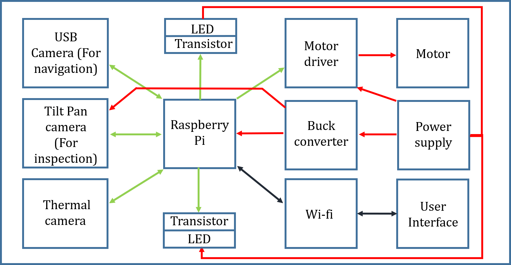
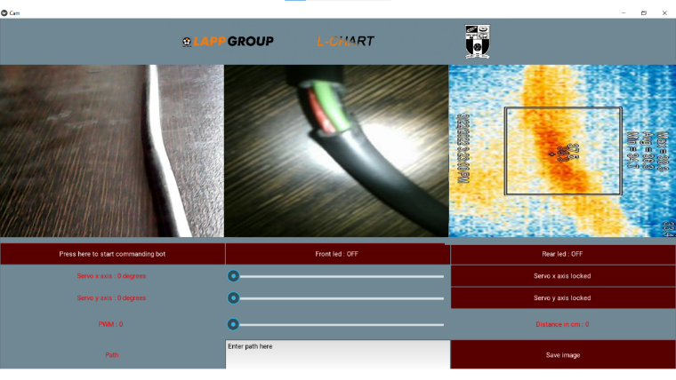

## Contents:
<ol>
   <li><a href="https://s-nithish-kumar.github.io/Lapp_Cable_External_Health_Analysis_and_Restoration_Test/#1-problem-statement">Problem Statement</a></li>
   <li><a href="https://s-nithish-kumar.github.io/Lapp_Cable_External_Health_Analysis_and_Restoration_Test/#2-objectives">Objectives</a></li>
   <li><a href="https://s-nithish-kumar.github.io/Lapp_Cable_External_Health_Analysis_and_Restoration_Test/#3-impact-of-solving-the-problem">Impact of Solving the Problem</a></li>
   <li><a href="https://s-nithish-kumar.github.io/Lapp_Cable_External_Health_Analysis_and_Restoration_Test/#4-proposed-approach">Proposed Approach</a></li>
   <li><a href="https://s-nithish-kumar.github.io/Lapp_Cable_External_Health_Analysis_and_Restoration_Test/#5-methodology-flowchart">Methodology Flowchart</a></li>
   <li><a href="https://s-nithish-kumar.github.io/Lapp_Cable_External_Health_Analysis_and_Restoration_Test/#6-user-profile-design">User Profile Design</a></li>
   <li><a href="https://s-nithish-kumar.github.io/Lapp_Cable_External_Health_Analysis_and_Restoration_Test/#7-technical-specifications">Technical Specifications</a></li>
   <li><a href="https://s-nithish-kumar.github.io/Lapp_Cable_External_Health_Analysis_and_Restoration_Test/#8-modeling-and-3d-printing">Modeling and 3D Printing</a></li>
   <li><a href="https://s-nithish-kumar.github.io/Lapp_Cable_External_Health_Analysis_and_Restoration_Test/#9-user-interface">User Interface</a>
   <ul>
      <li><a href="https://s-nithish-kumar.github.io/Lapp_Cable_External_Health_Analysis_and_Restoration_Test/#a-kivy-framework">Kivy Framework</a></li>
      <li><a href="https://s-nithish-kumar.github.io/Lapp_Cable_External_Health_Analysis_and_Restoration_Test/#b-user-data-protocol-(udp)">User Data Protocol (UDP)</a></li>
      <li><a href="https://s-nithish-kumar.github.io/Lapp_Cable_External_Health_Analysis_and_Restoration_Test/#c-transfer-control-protocol-(tcp)">Transfer Control Protocol (TCP)</a></li>
      <li><a href="https://s-nithish-kumar.github.io/Lapp_Cable_External_Health_Analysis_and_Restoration_Test/#d-main-application">Main Application</a></li>
      <li><a href="https://s-nithish-kumar.github.io/Lapp_Cable_External_Health_Analysis_and_Restoration_Test/#e-program-structure">Program Structure</a></li>
   </ul></li>
   <li><a href="https://s-nithish-kumar.github.io/Lapp_Cable_External_Health_Analysis_and_Restoration_Test/#10-problems-and-troubleshooting">Problems and Troubleshooting</a></li>
   <li><a href="https://s-nithish-kumar.github.io/Lapp_Cable_External_Health_Analysis_and_Restoration_Test/#11-conclusion-and-future-works">Conclusion and Future Works</a></li>
</ol>

### 1. Problem Statement:
- Cables play a major role in our day-to-day lives, from cell phone chargers to sophisticated electrical machines in industries. Monitoring cable health on a timely basis is very important to avoid accidents and downtime in industries.
- The Cables that are laid on overhead trays in industries have frequent faults due to stress on the wire, defects on the wire, rodents, degradation due to aging, etc. It is hard for a technician to climb up and look into every single tray. Moreover, multiple cables running on the trays and longer trays further complicate the process.

### 2. Objectives:
- To design a cart with different sensors to detect faults such as cracks and high temperatures in cables and indicate the faulty location.
- To design and develop a light-weight cart that can easily maneuver on rugged surfaces with a bunch of cables.

### 3. Impact of Solving the Problem:
- When a cable fault occurs, a worker must climb up to check sections of the cable tray where the fault might have occurred. When the number of cables increases, it becomes increasingly hard to detect faults through visual cues.
- Using a robot for inspection, the health of the cables laid on the trays can be assessed periodically by controlling the robot from the ground station without de-energizing the cables.
- Inspection with robots provides a way for periodic maintenance, which reduces downtime in industries.

### 4. Proposed Approach:
- The scope of this project is to develop a robot that uses belted wheels to traverse unevenly laid cables.
- The robot is equipped with two cameras, one facing the front and the other in the rear, placed on a tilt-pitch mechanism. The thermal camera is placed facing down to find the fault, as shown in Figure 1. 
- A Raspberry Pi SoC is used for controlling the robot and also to transmit the video feed to the user’s PC through Wi-Fi communication.

Figure 1 Outline of the Robot Design

### 5. Methodology Flowchart:
The flowchart below shows the methodology used in the design and development of the inspection robot. A few important steps in the development process are discussed in the following sections.

Figure 2 Methodology Flowchart

### 6. User Profile Design:
The push-pull method is used for the user profile design. This method has four main considerations, as shown below. 
- The Push - Need for the project
- The Pull - Why the proposed method is better
- Anxiety - Risk factors
- Inertia - Besides anxiety, what is propelling to proceed further with the project?

Figure 3 User Profile Design

### 7. Techincal Specifications:
The names and quantities of the components used for developing the inspection robot are shown in Table I.

- Two DC motors, one on the left side and another on the right side, are used to drive the robot. Encoders fixed to the motors that give signals are used to find the distance traveled by the robot. The motors are placed diagonally to reduce the width of the robot.
- The DC motor driver, which receives the signal from the Raspberry Pi, is used to control the motor's rotation.
The Raspberry Pi controller has in-built wi-fi communication, which is required for transmitting the camera feed to the user interface.
- A USB camera is used for robot navigation.
- A High-resolution Raspberry Pi camera is used for inspecting the cables in case of a temperature rise detected in the thermal camera.
- A thermal camera is used to find temperature rises in cables.
- Three 3.7V batteries are used to power up the Raspberry Pi and the motors.
- A Charge protection board is used to protect the batteries during charging and discharging to limit the current discharge rate.
- A buck converter is used to step down the voltage to power the servo motors.
- Rotary bearings are used to fix the robot wheels. Bearings are also used to avoid overloading the motors.
- Transistors are used to light up the LEDs.
- LED strips are used both at the front and rear to provide lighting if required.
- The System Level Design below shows the communication between the sensors and the Raspberry Pi. The power lines are indicated by red, the communication lines are indicated in green and the black line shows the wireless communication.

Figure 4 System Level Design

### 8. Modeling and 3D Printing:
Modeling is done using Fusion 360 software. The outline of the robot design with all the components fixed in the appropriate positions is shown in the proposed approach section. Lapp India Pvt. Ltd. is the owner of the project, and the design of the robot cannot be shown due to copyrights. The designed components are 3D printed with Polylactic acid (PLA) material.

### 9. User Interface:

Figure 5 Frontend of the Application

An application is developed in Python using the Kivy framework. The front end of the application enables the user to control the robot and view the video feed, and the backend is programmed to transmit the data through Wi-Fi to control the robot and also receive the video feed from the Raspberry Pi.  
#### A. Kivy framework
Kivy is a Python framework used for creating applications compatible with both mobile phones and PCs. The Python framework can be deployed on various platforms, such as Windows, Linux, MacOS, Android, and iOS.
#### B. User Data Protocol (UDP)
UDP is a protocol used in the transport layer of the OSI model and works on top of IP. UDP has a server and a client. The server initially requests the data from the client, and the client in turn sends a stream of continuous data. UDP has the facility to detect corrupt data but lacks an error-checking mechanism. This makes UDP faster, and hence it is mostly used for transmitting video data since error checking every frame slows down the process. In this project, UDP is used to transmit video data from a Raspberry Pi to a PC using Wi-Fi and socket communication.
#### C. Transfer Control Protocol (TCP)
TCP is also a transport layer protocol working on top of IP. Unlike UDP, TCP has an error-checking mechanism called "Handshaking". This makes TCP suitable for transmitting crucial alphanumeric data. TCP is used to transmit control data from the PC to the Raspberry Pi and simultaneously receive encoder data from the robot.  
#### D. Main Application
The application developed using the Kivy framework acts as the primary interface for the user to control the robot. The application consists of Labels, buttons, toggle buttons, sliders, and Text fields. Fig. 4 shows the front end of the application. The application also detects keys pressed by the user on the PC; this data is used to control the robot's movement and other functionalities.
#### E. Program Structure
The complete structure of the program is shown in Figure 4. "main.py" on both the Raspberry Pi and PC establishes a thread for all other programs to run simultaneously. "Client1.py", “Client2.py," and "Client3.py" are scripts to read camera data from the Raspberry Pi and establish UDP communication to send the video data to the PC. The script "Server1.py" acts as a server and receives the data to send it to the app. "Client4.py" establishes a TCP communication to receive Control data and send Encoder data. The script "Master_Control.py" controls the motor using the control data received from the TCP server and also reads encoder data to send it to the TCP Client. The "App.py" script runs the main application, which is the user interface, and it shows the video feed, buttons and sliders to control the robot, and facilities to save the image.

Figure 6 Program Structure

### 10. Problems and Troubleshooting:

### 11. Conclusion and Future Works:
- The robot has been successfully tested to find faults in power cables that are placed on horizontal cable trays. 
- Further improvements can be made by identifying methods to detect faults in data communication cables, and making the robot autonomous will help in conducting periodic checks without human supervision.
- IoT will help in collecting and analyzing data, which can help in predictive maintenance of the cable.

